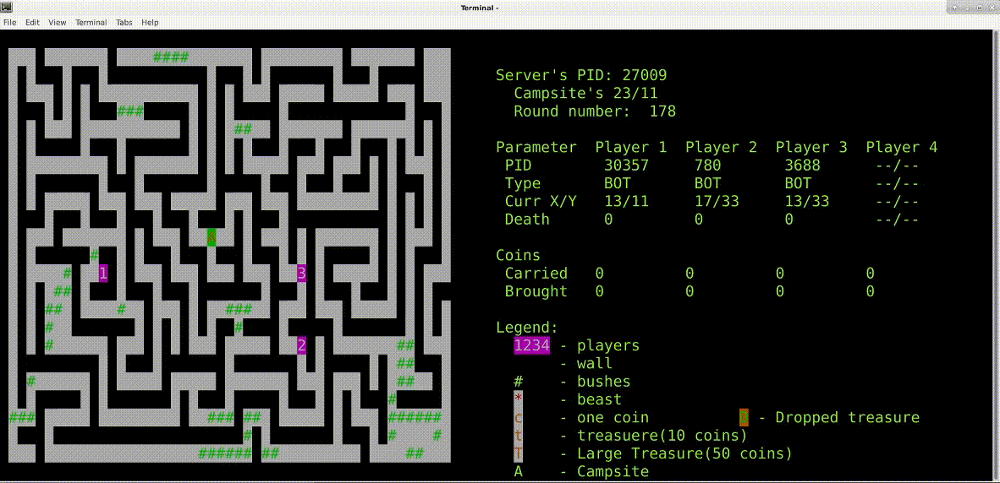

# Multithreaded-game
It's a project for my studies(Operating Systems).

## Acquired knowledge
1) Got the basic knowledge of threads, mutexes, semaphores and shared memory;
2) Used some rare libraries like ncurses, rt, pthread;
3) Build a simple game with simple algorithms;

### Example:

